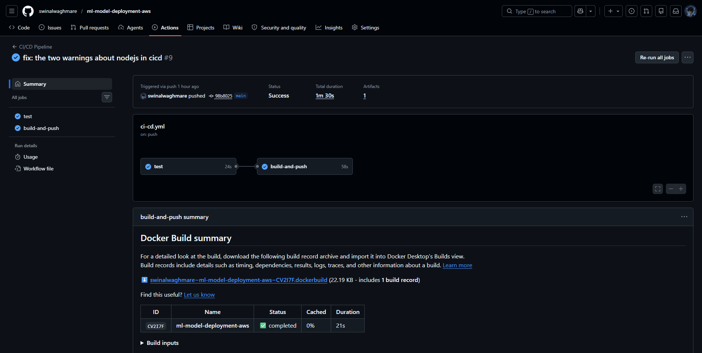
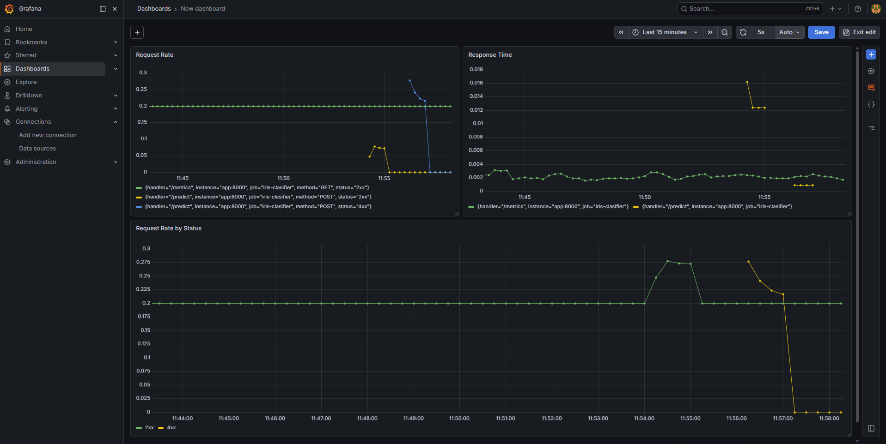

# 🚀 Automated CI/CD Pipeline for ML Model Deployment on AWS


An end-to-end MLOps project that containerizes a FastAPI-based ML inference service, automates deployment via GitHub Actions CI/CD, stores model artifacts in AWS S3, and monitors everything with Prometheus and Grafana.

---

## 📐 Architecture

```
Developer
    │
    │  git push
    ▼
GitHub Actions CI/CD Pipeline
    ├── Run Tests (pytest)
    ├── Build Docker Image
    └── Push to Docker Hub
             │
             ▼
      Docker Compose Stack
      ┌─────────────────────────────────────┐
      │                                     │
      │   nginx (port 80)                   │
      │     │  reverse proxy                │
      │     ▼                               │
      │   FastAPI App (port 8000)           │
      │     │  downloads model on startup   │
      │     ▼                               │
      │   AWS S3 (iris_model.pkl)           │
      │                                     │
      │   Prometheus (port 9090)            │
      │     │  scrapes /metrics every 5s    │
      │     ▼                               │
      │   Grafana (port 3000)               │
      │     └── Dashboard: request rate,    │
      │         response time, error rate   │
      └─────────────────────────────────────┘
```

---

## ✨ Features

- **ML Inference API** — FastAPI app serving an Iris flower classifier with `/predict`, `/health`, and `/model-info` endpoints
- **Dockerized** — fully containerized with a multi-service `docker-compose` setup
- **CI/CD Pipeline** — GitHub Actions automatically runs tests, builds image, and pushes to Docker Hub on every `git push`
- **S3 Model Storage** — model artifact (`iris_model.pkl`) stored in AWS S3 and pulled dynamically at container startup
- **Reverse Proxy** — nginx sits in front of the FastAPI app for production-like routing
- **Monitoring** — Prometheus scrapes live metrics, Grafana displays request rate, response time, and error rate in real time

---

## 🗂️ Project Structure

```
ml-model-deployment-aws/
├── .github/
│   └── workflows/
│       └── ci-cd.yml          # GitHub Actions pipeline
├── app/
│   ├── __init__.py
│   └── main.py                # FastAPI inference server
├── model/
│   ├── train.py               # Train and save the model
│   ├── iris_model.pkl         # Saved model artifact
│   └── model_metadata.json    # Accuracy, features, classes
├── tests/
│   └── test_api.py            # pytest test suite (8 tests)
├── Dockerfile                 # Container definition
├── docker-compose.yml         # Full stack: app + nginx + prometheus + grafana
├── nginx.conf                 # Reverse proxy config
├── prometheus.yml             # Prometheus scrape config
├── conftest.py                # pytest root config
├── requirements.txt
└── README.md
```

---

## 🚦 CI/CD Pipeline

Every `git push` to `main` triggers the GitHub Actions pipeline:

```
push to main
     │
     ▼
[ Job: test ]
  ├── checkout code
  ├── setup Python 3.12
  ├── pip install -r requirements.txt
  └── pytest tests/ -v  ──── 8/8 tests must pass
     │
     ▼ (only if tests pass)
[ Job: build-and-push ]
  ├── checkout code
  ├── docker login (via secrets)
  └── docker build + push → Docker Hub
```

**GitHub Secrets required:**
| Secret | Description |
|--------|-------------|
| `DOCKERHUB_USERNAME` | Your Docker Hub username |
| `DOCKERHUB_TOKEN` | Docker Hub access token (Read & Write) |

---

## ⚙️ Local Setup

### Prerequisites
- Python 3.12+
- Docker Desktop
- AWS CLI configured (`aws configure`)

### 1. Clone the repo
```bash
git clone https://github.com/swinalwaghmare/ml-model-deployment-aws.git
cd ml-model-deployment-aws
```

### 2. Create virtual environment
```bash
python -m venv venv
source venv/bin/activate       # Mac/Linux
venv\Scripts\activate          # Windows
pip install -r requirements.txt
```

### 3. Train the model
```bash
python model/train.py
```

### 4. Upload model to S3
```bash
aws s3 cp model/iris_model.pkl s3://YOUR_BUCKET/model/iris_model.pkl
aws s3 cp model/model_metadata.json s3://YOUR_BUCKET/model/model_metadata.json
```

### 5. Create `.env` file
```bash
AWS_ACCESS_KEY_ID=your_key
AWS_SECRET_ACCESS_KEY=your_secret
```

### 6. Run the full stack
```bash
docker-compose up --build
```

---

## 🔌 API Endpoints

| Method | Endpoint | Description |
|--------|----------|-------------|
| `GET` | `/health` | Health check + uptime |
| `POST` | `/predict` | Run inference |
| `GET` | `/model-info` | Model metadata |
| `GET` | `/metrics` | Prometheus metrics |
| `GET` | `/docs` | Swagger UI |

### Example: Predict
```bash
curl -X POST http://localhost/predict \
  -H "Content-Type: application/json" \
  -d '{"sepal_length":5.1,"sepal_width":3.5,"petal_length":1.4,"petal_width":0.2}'
```

**Response:**
```json
{
  "prediction": "setosa",
  "class_index": 0,
  "probabilities": {
    "setosa": 1.0,
    "versicolor": 0.0,
    "virginica": 0.0
  },
  "model_version": "RandomForestClassifier"
}
```

---

## 📊 Monitoring

| Service | URL | Credentials |
|---------|-----|-------------|
| Grafana Dashboard | `http://localhost:3000` | admin / admin |
| Prometheus | `http://localhost:9090` | — |
| API Metrics | `http://localhost:8000/metrics` | — |

**Grafana panels:**
- Request Rate — `rate(http_requests_total[1m])`
- Response Time — `rate(http_request_duration_seconds_sum[1m]) / rate(http_request_duration_seconds_count[1m])`
- Request Rate by Status — `sum by (status) (rate(http_requests_total[1m]))`

---

## 🧪 Running Tests

```bash
pytest tests/ -v
```

```
tests/test_api.py::test_health_status_ok              PASSED
tests/test_api.py::test_health_has_uptime             PASSED
tests/test_api.py::test_predict_setosa                PASSED
tests/test_api.py::test_predict_virginica             PASSED
tests/test_api.py::test_predict_returns_probabilities PASSED
tests/test_api.py::test_predict_missing_field         PASSED
tests/test_api.py::test_model_info_has_accuracy       PASSED
tests/test_api.py::test_model_info_accuracy_above_threshold PASSED

8 passed in 1.40s
```
---
## 📸 Screenshots

### CI/CD Pipeline — GitHub Actions


### Grafana Monitoring Dashboard



## 👤 Author

**Swinal Waghmare** — [github.com/swinalwaghmare](https://github.com/swinalwaghmare)
